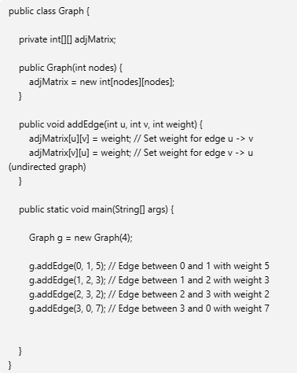

# Graph in DSA

# Adjacency Matrix of graph  

- Undirected 

.

.

- Directed 

.

- Undirected Weightage 

.

- same for directed graph but just need to store form u--> v not v--> u

# Adjacency List of graph

- Undirected 

.

.

- Directed

.

- Undirected Weigtage

.

- same for directed graph but just need to store form u--> v not v--> u

# Breadth-First Search (BFS)/ Level Order Traversal

.

# Depth-First Search (DFS) 

- Iterative

.

- Recursive

.

# Circle in Directed Graph

.

.

