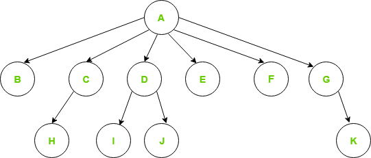

A generic tree, also known as a multi-way tree or N-ary tree, is a type of tree data structure in which each node can have an arbitrary number of children. Unlike binary trees where each node can have at most two children, generic trees allow for nodes to have any number of child nodes, making them more flexible for representing hierarchical data with varying branching factors.

**Key Characteristics of Generic Trees**

**Arbitrary Number of Children:** Each node can have zero or more children.

**Hierarchical Structure:** Represents hierarchical relationships where each node can act as a parent to multiple children.

**Root Node:** The topmost node in the tree, from which all other nodes descend.

**Leaf Nodes:** Nodes that do not have any children.

**Disadvantages of the above representation are:**

Memory Wastage – All the pointers are not required in all the cases. Hence, there is lot of memory wastage.
Unknown number of children – The number of children for each node is not known in advance.
