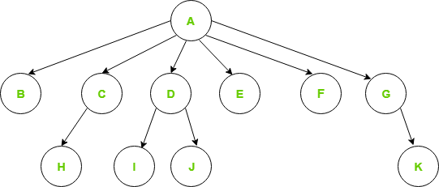

## Generic Tree

A generic tree, also known as a multi-way tree or N-ary tree, is a type of tree data structure in which each node can have an arbitrary number of children. Unlike binary trees where each node can have at most two children, generic trees allow for nodes to have any number of child nodes, making them more flexible for representing hierarchical data with varying branching factors.

```
General Tree
└─── N-ary Tree (Generic Tree)
     └── Ternary Tree
```

**Key Characteristics of Generic Trees**

**Arbitrary Number of Children:** Each node can have zero or more children.

**Hierarchical Structure:** Represents hierarchical relationships where each node can act as a parent to multiple children.

**Root Node:** The topmost node in the tree, from which all other nodes descend.

**Leaf Nodes:** Nodes that do not have any children.




**Usecases of Generic Trees**

**File Systems:** Representing directories and files where each directory can contain an arbitrary number of subdirectories and files.

**Hierarchical Data:** Organizational structures, taxonomies, and other hierarchical data representations.

**Game Development:** Representing game states or moves where each state can lead to multiple possible next states.

**Disadvantages of the above representation are:**

Memory Wastage – All the pointers are not required in all the cases. Hence, there is lot of memory wastage.
Unknown number of children – The number of children for each node is not known in advance.


## Ternary Tree

A ternary tree is a type of tree data structure where each node has at most three children. These children are typically referred to as the left child, the middle child, and the right child.


**Properties**

**Each node has up to three children:** Unlike binary trees, which have at most two children per node, ternary trees can have up to three children.

**Flexible structure:** The three-child structure provides more flexibility for certain applications compared to binary trees.

**Generalization:** Ternary trees can be seen as a generalization of binary trees and a specific case of N-ary trees where N=3.

**Use Cases**

**Ternary Search Trees:** Used for efficient searching, similar to binary search trees, but with additional middle children that can handle equal keys or values.

**Trie-like Structures:** Can be used for prefix trees (tries) where each node can represent a character, and the three children can represent different branching characters.

**Mathematical and Expression Trees:** Useful in representing mathematical expressions where an operator might have three operands.

**Operations on Ternary Trees**

The basic operations on ternary trees are similar to those on binary trees but need to account for the additional child node.

**Insertion**

Inserting a new node involves finding the appropriate location in the tree and placing the new node as a child (left, middle, or right) of the existing node.

**Deletion**

Deleting a node from a ternary tree can be more complex than from a binary tree due to the additional child. The three main cases (leaf node, node with one child, node with multiple children) need to be handled appropriately.

**Search**

Searching in a ternary tree is typically done similarly to a binary search tree, but with additional comparisons to handle the middle child.

**Here is an example implementation of a simple ternary tree in Java:**

```
class TernaryNode {
    int key;
    TernaryNode left, middle, right;

    public TernaryNode(int item) {
        key = item;
        left = middle = right = null;
    }
}

class TernaryTree {
    TernaryNode root;

    // Constructor
    TernaryTree() {
        root = null;
    }

    // Insertion method
    TernaryNode insert(TernaryNode node, int key) {
        if (node == null) {
            node = new TernaryNode(key);
            return node;
        }

        if (key < node.key) {
            node.left = insert(node.left, key);
        } else if (key == node.key) {
            node.middle = insert(node.middle, key);
        } else {
            node.right = insert(node.right, key);
        }

        return node;
    }

    // Search method
    boolean search(TernaryNode node, int key) {
        if (node == null) {
            return false;
        }

        if (node.key == key) {
            return true;
        }

        if (key < node.key) {
            return search(node.left, key);
        } else if (key == node.key) {
            return search(node.middle, key);
        } else {
            return search(node.right, key);
        }
    }

    // In-order traversal
    void inorder(TernaryNode node) {
        if (node != null) {
            inorder(node.left);
            System.out.print(node.key + " ");
            inorder(node.middle);
            inorder(node.right);
        }
    }

    public static void main(String[] args) {
        TernaryTree tree = new TernaryTree();

        /* Insert nodes */
        tree.root = tree.insert(tree.root, 10);
        tree.root = tree.insert(tree.root, 5);
        tree.root = tree.insert(tree.root, 20);
        tree.root = tree.insert(tree.root, 10); // Duplicate key
        tree.root = tree.insert(tree.root, 15);
        tree.root = tree.insert(tree.root, 25);

        /* Print in-order traversal */
        System.out.println("In-order traversal of the ternary tree:");
        tree.inorder(tree.root);

        /* Search for a key */
        int key = 15;
        if (tree.search(tree.root, key)) {
            System.out.println("\nKey " + key + " found in the tree.");
        } else {
            System.out.println("\nKey " + key + " not found in the tree.");
        }
    }
}

```

**Explanation of the Code**

**TernaryNode Class:** Represents each node in the ternary tree, containing the key and pointers to the left, middle, and right children.

**TernaryTree Class:** Contains methods for inserting nodes, searching for keys, and in-order traversal.

**Insertion Method:** Inserts a new node into the tree, placing it as a left, middle, or right child based on comparisons.

**Search Method:** Searches for a key in the tree, recursively checking the left, middle, or right child based on comparisons.

**In-order Traversal Method:** Prints the keys of the tree in in-order sequence.

**Main Method:** Demonstrates inserting nodes into the tree, performing in-order traversal, and searching for a key.
