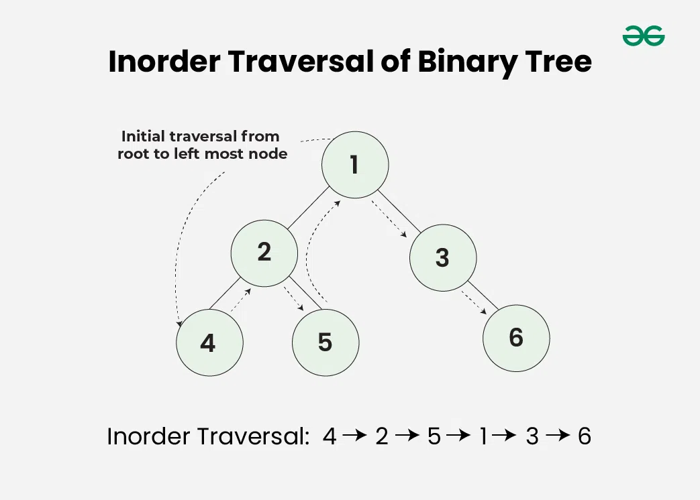
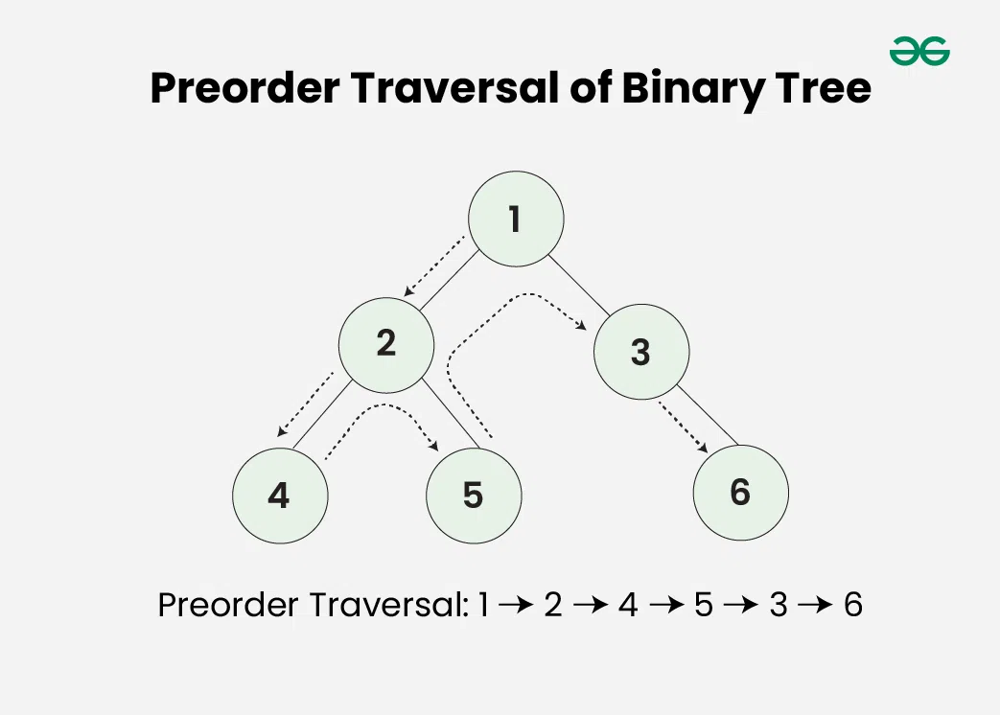

## Tree Traversal Techniques

Tree Traversal techniques include various ways to visit all the nodes of the tree. Unlike linear data structures (Array, Linked List, Queues, Stacks, etc) which have only one logical way to traverse them, trees can be traversed in different ways. In this article, we will discuss about all the tree traversal techniques along with their uses.

.webp)

### Tree Traversal Techniques:


A Tree Data Structure can be traversed in following ways:

- Depth First Search or DFS
  - Inorder Traversal
  - Preorder Traversal
  - Postorder Traversal

- Level Order Traversal or Breadth First Search or BFS

**Inorder Traversal :**



Inorder traversal visits the node in the order: Left -> Root -> Right

Algorithm for Inorder Traversal:

Inorder(tree)

Traverse the left subtree, i.e., call Inorder(left->subtree)

Visit the root.

Traverse the right subtree, i.e., call Inorder(right->subtree)

**Uses of Inorder Traversal:**

In the case of binary search trees (BST), Inorder traversal gives nodes in non-decreasing order.

To get nodes of BST in non-increasing order, a variation of Inorder traversal where Inorder traversal is reversed can be used.

Inorder traversal can be used to evaluate arithmetic expressions stored in expression trees.

```
void printInorder(Node node)
{
    if (node == null)
        return;

    // First recur on left child
    printInorder(node.left);

    // Then print the data of node
    System.out.print(node.key + " ");

    // Now recur on right child
    printInorder(node.right);
}
```


**Output**
Inorder traversal of binary tree is 

4 2 5 1 3 

**Time Complexity:** O(N)

**Auxiliary Space:** If we don’t consider the size of the stack for function calls then O(1) otherwise O(h) where h is the height of the tree.


**Preorder Traversal :**



Preorder traversal visits the node in the order: Root -> Left -> Right

Algorithm for Preorder Traversal:

Preorder(tree)

Visit the root.

Traverse the left subtree, i.e., call Preorder(left->subtree)

Traverse the right subtree, i.e., call Preorder(right->subtree)

**Uses of Preorder Traversal:**

Preorder traversal is used to create a copy of the tree.

Preorder traversal is also used to get prefix expressions on an expression tree.

```
// Given a binary tree, print its nodes in preorder
void printPreorder(Node node)
{
    if (node == null)
        return;

    // First print data of node
    System.out.print(node.key + " ");

    // Then recur on left subtree
    printPreorder(node.left);

    // Now recur on right subtree
    printPreorder(node.right);
}

```


**Output**

Preorder traversal of binary tree is 

1 2 4 5 3 

**Time Complexity:** O(N)

**Auxiliary Space:** If we don’t consider the size of the stack for function calls then O(1) otherwise O(h) where h is the height of the tree.


**Postorder Traversal :**


Postorder traversal visits the node in the order: Left -> Right -> Root

**Algorithm for Postorder Traversal:**

Algorithm Postorder(tree)

Traverse the left subtree, i.e., call Postorder(left->subtree)

Traverse the right subtree, i.e., call Postorder(right->subtree)

Visit the root

**Uses of Postorder Traversal:**

Postorder traversal is used to delete the tree. See the question for the deletion of a tree for details.

Postorder traversal is also useful to get the postfix expression of an expression tree.

Postorder traversal can help in garbage collection algorithms, particularly in systems where manual memory management is used.

```
// Given a binary tree, print its nodes according to the
// "bottom-up" postorder traversal.
void printPostorder(Node node)
{
    if (node == null)
        return;

    // First recur on left subtree
    printPostorder(node.left);

    // Then recur on right subtree
    printPostorder(node.right);

    // Now deal with the node
    System.out.print(node.key + " ");
}

```

**Output**

Postorder traversal of binary tree is 

4 5 2 3 1 
