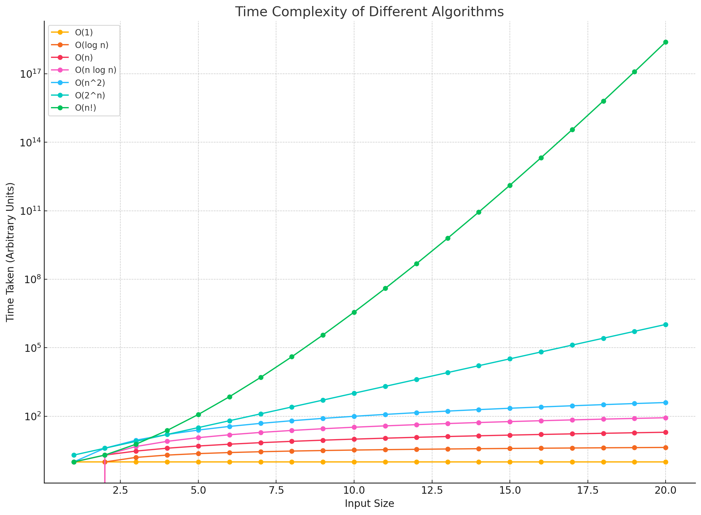
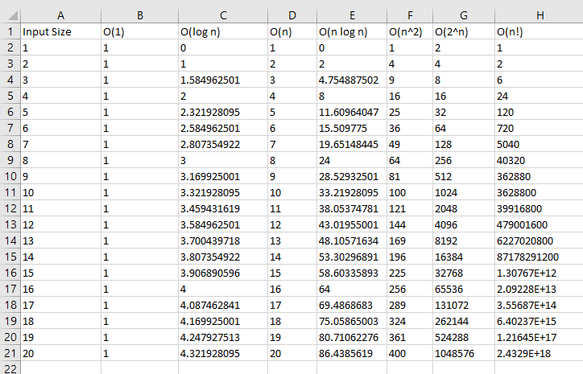

# Time and Space Complexity

Time and space complexity are measures used to describe the efficiency of an algorithm. They help to understand the performance of an algorithm in terms of the time it takes to run (time complexity) and the amount of memory it uses (space complexity).

## Time Complexity

Time complexity is a way to represent the amount of time an algorithm takes to run as a function of the length of the input. It helps to estimate the execution time of an algorithm.

## Space Complexity

Space complexity measures the amount of memory an algorithm uses as a function of the length of the input. It includes both the memory used by the variables and the call stack in the case of recursion.

## Common Time Complexities

### O(1) - Constant Time

The running time of the algorithm is constant, regardless of the input size.

**Example: Accessing an element in an array by index.**

```
public class ConstantTime {
    public static int accessElement(int[] arr, int index) {
        return arr[index];  // O(1) - Accessing an element by index takes constant time
    }

    public static void main(String[] args) {
        int[] arr = {1, 2, 3, 4, 5};
        System.out.println(accessElement(arr, 2));  // Output: 3
    }
}

// Time Complexity: O(1) - The running time is constant, regardless of the input size.
// Space Complexity: O(1) - No extra space is used relative to input size.

```


### O(log n) - Logarithmic Time

The running time grows logarithmically with the input size.

**Example: Binary search in a sorted array.**

```
public class LogarithmicTime {
    public static int binarySearch(int[] arr, int target) {
        int left = 0, right = arr.length - 1;
        while (left <= right) {  // O(log n) - Halving the search space each iteration
            int mid = left + (right - left) / 2;
            if (arr[mid] == target) {  // O(1) - Constant time comparison
                return mid;
            } else if (arr[mid] < target) {
                left = mid + 1;
            } else {
                right = mid - 1;
            }
        }
        return -1;
    }

    public static void main(String[] args) {
        int[] arr = {1, 2, 3, 4, 5};
        System.out.println(binarySearch(arr, 3));  // Output: 2
    }
}

// Time Complexity: O(log n) - The running time grows logarithmically with the input size.
// Space Complexity: O(1) - No extra space is used relative to input size.
```


### O(n) - Linear Time
The running time grows linearly with the input size.

**Example: Finding the maximum element in an array.**

```
public class LinearTime {
    public static int findMax(int[] arr) {
        int maxElement = arr[0];  // O(1) - Initializing a variable
        for (int element : arr) {  // O(n) - Iterating through the array
            if (element > maxElement) {  // O(1) - Constant time comparison
                maxElement = element;  // O(1) - Constant time assignment
            }
        }
        return maxElement;
    }

    public static void main(String[] args) {
        int[] arr = {1, 2, 3, 4, 5};
        System.out.println(findMax(arr));  // Output: 5
    }
}

// Time Complexity: O(n) - The running time grows linearly with the input size.
// Space Complexity: O(1) - Only a few extra variables are used, regardless of input size.
```

### O(n log n) - Linearithmic Time

The running time grows in proportion to n log n.

**Example: Efficient sorting algorithms like Merge Sort.**

```
public class LinearithmicTime {

    // Function to perform merge sort
    public static void mergeSort(int[] arr) {
        if (arr.length > 1) {
            int mid = arr.length / 2;
            int[] leftHalf = new int[mid];
            int[] rightHalf = new int[arr.length - mid];

            // Split the array into two halves
            System.arraycopy(arr, 0, leftHalf, 0, mid);
            System.arraycopy(arr, mid, rightHalf, 0, arr.length - mid);

            // Recursively sort each half
            mergeSort(leftHalf);
            mergeSort(rightHalf);

            // Merge the sorted halves
            merge(arr, leftHalf, rightHalf);
        }
    }

    // Function to merge two sorted arrays
    public static void merge(int[] arr, int[] leftHalf, int[] rightHalf) {
        int i = 0, j = 0, k = 0;
        while (i < leftHalf.length && j < rightHalf.length) {
            if (leftHalf[i] < rightHalf[j]) {
                arr[k++] = leftHalf[i++];
            } else {
                arr[k++] = rightHalf[j++];
            }
        }
        while (i < leftHalf.length) {
            arr[k++] = leftHalf[i++];
        }
        while (j < rightHalf.length) {
            arr[k++] = rightHalf[j++];
        }
    }

    // Main method to test the merge sort
    public static void main(String[] args) {
        int[] arr = {5, 2, 3, 1, 4};
        mergeSort(arr);
        for (int num : arr) {
            System.out.print(num + " ");
        }
    }
}
// Time Complexity: O(n log n) - The running time grows in proportion to n log n.
// Space Complexity: O(n) - Additional space for the temporary arrays used during merging.

```


### O(n^2) - Quadratic Time
The running time grows quadratically with the input size.

**Example: Bubble Sort.**

```
public class QuadraticTime {
    public static void bubbleSort(int[] arr) {
        int n = arr.length;
        for (int i = 0; i < n; i++) {  // O(n) - Outer loop
            for (int j = 0; j < n - i - 1; j++) {  // O(n) - Inner loop
                if (arr[j] > arr[j + 1]) {  // O(1) - Constant time comparison
                    int temp = arr[j];
                    arr[j] = arr[j + 1];
                    arr[j + 1] = temp;  // O(1) - Constant time swap
                }
            }
        }
    }

    public static void main(String[] args) {
        int[] arr = {5, 2, 3, 1, 4};
        bubbleSort(arr);
        for (int num : arr) {
            System.out.print(num + " ");  // Output: 1 2 3 4 5
        }
    }
}

// Time Complexity: O(n^2) - The running time grows quadratically with the input size.
// Space Complexity: O(1) - Only a few extra variables are used, regardless of input size.
```

### O(2^n) - Exponential Time
The running time grows exponentially with the input size.

**Example: Solving the Tower of Hanoi problem.**

```
public class ExponentialTime {
    public static void towerOfHanoi(int n, char source, char target, char auxiliary) {
        if (n == 1) {
            System.out.println("Move disk 1 from " + source + " to " + target);  // O(1) - Base case
            return;
        }
        towerOfHanoi(n - 1, source, auxiliary, target);  // O(2^n-1) - Recursive call
        System.out.println("Move disk " + n + " from " + source + " to " + target);  // O(1) - Move disk
        towerOfHanoi(n - 1, auxiliary, target, source);  // O(2^n-1) - Recursive call
    }

    public static void main(String[] args) {
        towerOfHanoi(3, 'A', 'C', 'B');
    }
}

// Time Complexity: O(2^n) - The running time grows exponentially with the input size.
// Space Complexity: O(n) - The call stack grows linearly with the number of disks.
```

### O(n!) - Factorial Time
The running time grows factorially with the input size.

**Example: Generating all permutations of a set.**

```
import java.util.ArrayList;
import java.util.List;

public class FactorialTime {
    public static List<List<Integer>> generatePermutations(int[] nums) {
        List<List<Integer>> result = new ArrayList<>();
        permute(nums, 0, result);
        return result;
    }

    private static void permute(int[] nums, int start, List<List<Integer>> result) {
        if (start == nums.length) {
            List<Integer> permutation = new ArrayList<>();
            for (int num : nums) {
                permutation.add(num);
            }
            result.add(permutation);  // O(n!) - Generating all permutations
        } else {
            for (int i = start; i < nums.length; i++) {
                swap(nums, start, i);
                permute(nums, start + 1, result);  // O(n!) - Recursive call for permutations
                swap(nums, start, i);  // Backtrack
            }
        }
    }

    private static void swap(int[] nums, int i, int j) {
        int temp = nums[i];
        nums[i] = nums[j];
        nums[j] = temp;
    }

    public static void main(String[] args) {
        int[] nums = {1, 2, 3};
        List<List<Integer>> permutations = generatePermutations(nums);
        for (List<Integer> perm : permutations) {
            System.out.println(perm);
        }
    }
}

// Time Complexity: O(n!) - The running time grows factorially with the input size.
// Space Complexity: O
```

### Common Space Complexities
**O(1) - Constant Space:**
 
The algorithm uses a fixed amount of space regardless of the input size.
Example: Simple operations that only require a few variables.

**O(n) - Linear Space:**

The space used by the algorithm grows linearly with the input size.
Example: Storing elements in an array.

**O(n^2) - Quadratic Space:**

The space used by the algorithm grows quadratically with the input size.
Example: Creating a 2D array for dynamic programming.







## Asymptotic Notations: Big O, Omega, and Theta
Asymptotic notations are mathematical tools used to describe the limiting behavior of a function when the argument tends towards a particular value or infinity. In the context of algorithms, they describe the efficiency and performance of algorithms in terms of time and space complexity.

Here, we'll focus on three main notations: Big O (O), Omega (Ω), and Theta (Θ), and we'll provide basic examples in Java to illustrate each concept.

### 1. Big O Notation (O)
Definition: Big O notation describes the upper bound of the time complexity. It gives the worst-case scenario for the growth rate of an algorithm's running time as the input size increases.

Example: Linear Search

In a linear search, we look for an element in an unsorted list by checking each element one by one.

```
public class LinearSearch {
    public static int linearSearch(int[] arr, int target) {
        for (int i = 0; i < arr.length; i++) {
            if (arr[i] == target) {
                return i;
            }
        }
        return -1; // target not found
    }

    public static void main(String[] args) {
        int[] arr = {5, 2, 3, 1, 4};
        int target = 3;
        int result = linearSearch(arr, target);
        System.out.println("Element found at index: " + result);
    }
}
```
**Time Complexity: O(n)** - In the worst case, we might have to check all n elements.

**Space Complexity: O(1)** - Only a few extra variables are used.

### 2. Omega Notation (Ω)
Definition: Omega notation describes the lower bound of the time complexity. It gives the best-case scenario for the growth rate of an algorithm's running time.

Example: Linear Search (Best Case)

Using the same linear search example:

```
public class LinearSearchBestCase {
    public static int linearSearch(int[] arr, int target) {
        for (int i = 0; i < arr.length; i++) {
            if (arr[i] == target) {
                return i;
            }
        }
        return -1; // target not found
    }

    public static void main(String[] args) {
        int[] arr = {5, 2, 3, 1, 4};
        int target = 5; // Best case, the target is the first element
        int result = linearSearch(arr, target);
        System.out.println("Element found at index: " + result);
    }
}
```
**Best Case Time Complexity: Ω(1)** - If the target element is the first element in the list, the search will be completed in constant time.

**Space Complexity: O(1)** - Only a few extra variables are used.

### 3. Theta Notation (Θ)
Definition: Theta notation describes the tight bound of the time complexity. It gives an exact asymptotic behavior by providing both the upper and lower bounds.

Example: Insertion Sort

Insertion sort sorts an array by iteratively taking an element and inserting it into its correct position.

```
public class InsertionSort {
    public static void insertionSort(int[] arr) {
        for (int i = 1; i < arr.length; i++) {
            int key = arr[i];
            int j = i - 1;
            while (j >= 0 && arr[j] > key) {
                arr[j + 1] = arr[j];
                j--;
            }
            arr[j + 1] = key;
        }
    }

    public static void main(String[] args) {
        int[] arr = {5, 2, 3, 1, 4};
        insertionSort(arr);
        for (int num : arr) {
            System.out.print(num + " ");
        }
    }
}
```

**Time Complexity: Θ(n^2)** - In both the average and worst-case scenarios, each element might need to be compared with every other element.

**Space Complexity: O(1)** - Only a few extra variables are used.

### Summary of Asymptotic Notations

**Big O (O)** - Describes the worst-case scenario.
Example: Finding an element in an unsorted array (Linear Search).
Code: O(n)

**Omega (Ω)** - Describes the best-case scenario.
Example: Finding the first element in an array (Linear Search Best Case).
Code: Ω(1)

**Theta (Θ)** - Describes the exact bound (both upper and lower bounds).
Example: Sorting an array using Insertion Sort.
Code: Θ(n^2)

**Visual Representation**
Imagine these notations on a graph where the x-axis represents the input size (n) and the y-axis represents the time or space complexity:

**O(n):** The line representing the growth rate will not be exceeded.
**Ω(1):** The line representing the best-case growth rate.
**Θ(n^2):** The line represents the exact growth rate, providing both upper and lower bounds.

**Conclusion**
Asymptotic notations are crucial in understanding and comparing the efficiency of algorithms. They provide a high-level understanding of how an algorithm performs as the input size increases, helping developers make informed decisions about which algorithm to use based on the problem's constraints and requirements.
